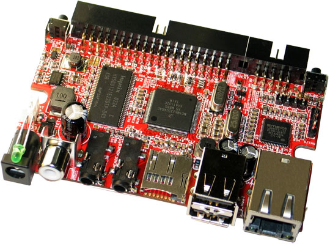
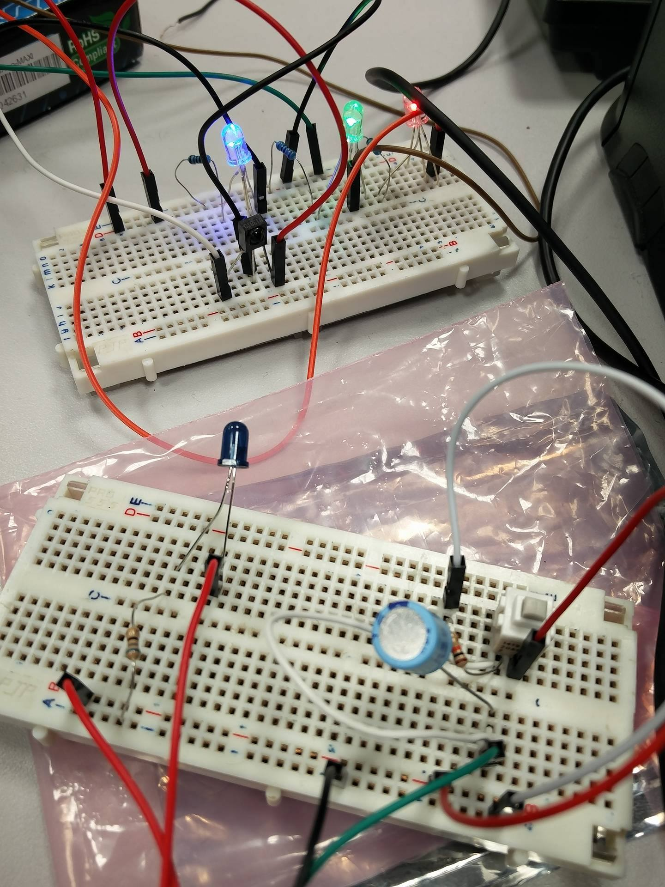

# Guirelande-infrarouge
Guirelande infrarouge développéé dans le cadre de la semaine bloquée LE, TELECOM Nancy.
Les développeurs présents sur le projet sont les suivants :

	1. BERNET Quentin (groupe1)
	2. TRABELSI Yassine (groupe1)
	3. BALDINI Kévin (groupe2)
	4. GRANDURY Benjamin (groupe2)

# Matériel nécessaire
Le matériel nécessaire, en dehors des LEDS, Résistances, condensateurs et LED Infrarouge sont
2 OLIMEX OlinuXino.

## Driver
Le noyau Linux ainsi que les drivers ont été développés grace à buildroot
[Lien de documentation buildroot](https://buildroot.uclibc.org/)
## GPIOS utilisées
### Pour la guirelande :

	* 1 : LED BLEU
 	* 2 : RECEPTEUR INFRAROUGE
 	* 4 : LED VERTE
 	* 5 : LED ROUGE
 Les numéros de GPIOS, sont les numéros LINUX.
 Voici un exemple de déclaration de GPIOS

    static struct gpio mygpios[] = {
	{ 1, GPIOF_OUT_INIT_HIGH, "LED BLEUE" },
	{ 2, GPIOF_IN, "INFRAROUGE" },
	{ 4, GPIOF_OUT_INIT_HIGH, "LED VERTE" },
	{ 5, GPIOF_OUT_INIT_HIGH, "LED ROUGE" },};
### Pour la telecomande

	* 1 : Bouton
	 Les numéros de GPIOS, sont les numéros LINUX.
	 Voici la déclaration de la gpio utilisée.

    static struct gpio button_gpio[] = {
	{1, GPIOF_IN, "Button"}};

	Nous avons aussi utilisé la sortie PWM afin d'alimenter la led infrarouge
	La déclaration pour l'utilisation de cette sortie est la suivante :

	struct pwm_device * pwm0;

	Configuration (les valeurs 13000 et 26000 définissent la fréquence
		du signal envoyé par la PWM et correspondent à celles attendues
		pour un signal infrarouge):

	pwm0 = pwm_request(2,"test-pwm");
	pwm_config(pwm0,13000,26000);

	Activation :

	pwm_enable(pwm0);

	Désactivation :

	pwm_disable(pwm0);

# Répartition du travail
Le premier groupe a travaillé sur le développement de la guirelande.

	* Montage des LEDS
	* Montage du bouton avec gestion interruption (bouton ensuite remplacé par LED réception infrarouge)
	* Ecriture du driver gérant les différents modes de la guirelande
		* Mode 0 : 3 LEDS allumées sans clignotement
		* Mode 1 : 3 LEDS avec clignotement différé
		* Mode 2 : 3 LEDS avec clignotement simultané

Le deuxième groupe a travaillé sur la "telecomande infrarouge"

	* Montage de la LED infrarouge
	* Montage du bouton avec gestion interruption (activation de la LED)
	* Ecriture du driver permettant de contrôler la LED

# Montage

Voici un exemple de montage possible avec en arrière plan la guirelande et devant, la telecomande
infrarouge

# Utilisation
## Communication guirelande
### Communication directe
Il est possible de changer de mode de guirelande en écrivant directement dans le fichier afin de communiquer avec la guirelande

    echo "\x0" > /dev/light

Envoyer 0,1 ou 2 selon le mode choisi
### Communication infrarouge
Il est possible de changer de mode de guirelande avec un appuie sur le bouton de la telecomande
infrarouge. Ainsi, vous pouvez passer au mode suivant sans pour autant choisir directement le mode que vous souhaitez.
